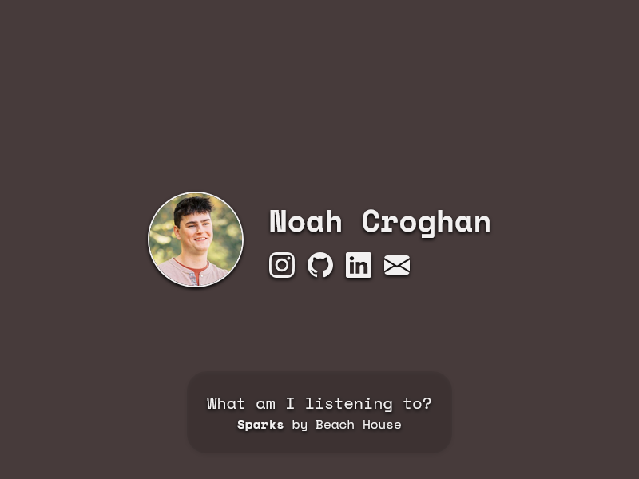

# Personal Website

This repository contains the code for my personal link-in-bio site,
featuring social links and a real-time Last.fm "now playing" widget.

## Table of Contents

- [Personal Website](#personal-website)
  - [Table of Contents](#table-of-contents)
  - [Preview](#preview)
  - [Local Development](#local-development)
  - [Building](#building)
  - [Deploying](#deploying)
  - [Credits](#credits)
  - [License](#license)

## Preview



## Local Development

1: Clone and enter the project:

```bash
git clone https://github.com/noahcroghan/personal-website.git
cd personal-website
```

2: Set up environment variables:

Copy `.env.example` to `.env` and fill in your [Last.fm API key](https://www.last.fm/api/accounts)
and username.

3: Install [dependencies](https://bun.sh) and start the dev server:

```bash
bun install
bun run dev
```

## Building

To build the website, run the following:

```bash
bun run build
```

This will go through the process of building the website with [Vite](https://vite.dev).
It also copies `functions/` into `dist/`, which Cloudflare Pages compiles into a
Function on deploy.

The site is written in [TypeScript](https://www.typescriptlang.org). Vite strips
types during the build without checking them, and Cloudflare Pages compiles the
Function in `functions/` on deploy, so run the type checker separately:

```bash
bun run typecheck
```

## Deploying

- This website is deployed using [Cloudflare Pages](https://pages.cloudflare.com).
  - Set `LASTFM_API_KEY` and `LASTFM_USERNAME` as Pages Function secrets in the
    project's dashboard settings, so `functions/now-playing.ts` can read them
    server-side at request time. These are never exposed to the client.
- Set the framework to none and follow Vite's [build instructions](https://vite.dev/guide/static-deploy.html).

## Credits

- Icons are courtesy of [Bootstrap Icons](https://icons.getbootstrap.com/).
- Font used is [Space Mono](https://fonts.google.com/specimen/Space+Mono).
  - Font License: [SIL Open Font License, Version 1.1](https://openfontlicense.org/open-font-license-official-text).

## License

[MIT License](./LICENSE).
